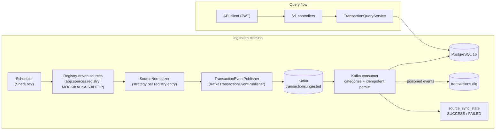

# Transaction Aggregation API

**Reference stack**

- Java 21
- Spring Boot 4.1.1
- Spring Kafka (used in-process via an application-owned messaging port)
- PostgreSQL 16
- Flyway (V1-V4)
- Docker / Docker Compose
- OpenAPI (`openapi.yaml` is the committed contract; no springdoc annotation layer)
- JUnit 5 / Testcontainers / Playwright
- Micrometer → Prometheus endpoint (`/actuator/prometheus`)

**Messaging principle:** Kafka is the demonstration broker (`transactions.ingested` + `transactions.dlq`). The application publishes through its own port — `TransactionEventPublisher`, implemented by `KafkaTransactionEventPublisher` — so the broker is replaceable without rewriting domain or application logic.

---

## Problem

Financial transaction data is fragmented across heterogeneous sources: different payload shapes, different naming conventions, and source-scoped IDs that are not globally unique. Consumers need a single canonical view they can query, but they must never be misled about how complete or how fresh that view is.

The system must:

1. Ingest from multiple sources without duplicating records on retries.
2. Normalize into one canonical transaction model with correct monetary arithmetic.
3. Categorize deterministically and explainably.
4. Serve a query API with stable pagination, per-currency SQL aggregates, and explicit freshness/completeness metadata.
5. Isolate customers from each other (JWT `sub` must match the path `customerId`, unless the caller is `ADMIN`).

## Architecture

Modular monolith (`za.co.evilcorp.transact`) with two flows:



- **Ingestion:** ShedLock-scheduled cycle → each registered source (transport selected by `app.sources.registry`: `MOCK`, `KAFKA`, `S3`, or `HTTP`) fetches from its cursor (`source_sync_state`), normalizes to `CanonicalTransaction` via its `SourceNormalizer` strategy, publishes a `TransactionIngestedEvent` → Kafka consumer applies deterministic categorization and persists idempotently against `UNIQUE(source_id, source_transaction_id)` → sync state updated to `SUCCESS` or `FAILED`.
- **Query:** controllers are thin; `TransactionQueryService` executes keyset queries and SQL `SUM` aggregates against PostgreSQL.
- **Layers:** `api` (HTTP + DTOs) → `application` (use-case services, scheduler, `application.dto`) → `domain` (canonical model, categorizer) → `infrastructure` (persistence, integration adapters, Kafka publisher, logging, observability). Constructor injection only; services are stateless.

## Key Decisions

| Decision | Rationale | ADR |
| :--- | :--- | :--- |
| Modular monolith, not microservices | Clear boundaries without distributed-system overhead; extractable later | [001](docs/adr/001-modular-monolith.md) |
| Eventual consistency + freshness metadata | Source outages must not make the API unavailable or lie about data age | [002](docs/adr/002-eventual-consistency.md), [008](docs/adr/008-partial-results-freshness.md) |
| Identity = `(source_id, source_transaction_id)` unique pair + internal UUID | Source IDs are only source-scoped; the DB constraint is the idempotency guarantee | [003](docs/adr/003-transaction-identity.md), [005](docs/adr/005-idempotent-ingestion.md) |
| `BigDecimal` / `DECIMAL(19,4)` for money | No floating-point rounding in financial records | [004](docs/adr/004-monetary-precision.md) |
| Adapter ports per source, normalization at the source boundary | Heterogeneous formats stop at the boundary regardless of transport | [006](docs/adr/006-adapter-source-integration.md) |
| Config-driven source registry: transport in YAML, normalization in code | New source = a registry entry (+ a `SourceNormalizer` if the payload shape is new), not a new adapter class | [011](docs/adr/011-config-driven-source-registry.md) |
| Deterministic rule-based categorization with persisted `ruleId` | Explainable categories; `category_version` tracks rule-set revisions | [007](docs/adr/007-deterministic-categorization.md) |
| Kafka included, behind an application-owned publisher port | Broker demonstrated without lock-in; pure synchronous alternative rejected | [009](docs/adr/009-kafka-messaging-port.md) |
| No Redis caching | Query-time reads from indexed PostgreSQL are sufficient at this scale | [010](docs/adr/010-no-redis-caching.md) |
| Keyset pagination on `(transaction_date DESC, id DESC)` | Stable ordering that survives inserts; no offset scans | — |
| SQL-side summary aggregates per currency | No in-memory reduction of full result sets; no silent FX conversion | — |

## Assumptions

- **The committed default registry ships three in-process `MOCK` sources** (`SOURCE_A`/`SOURCE_B`/`SOURCE_C`) so the demo and E2E suite stay deterministic and offline. Real `KAFKA`, `S3`, and `HTTP` transports exist (see [Sources](#sources)) and are opt-in per environment via `app.sources.registry` — they are not mocks once configured. Timeouts (per-transport) and bounded backoff (in `IngestionService`'s retry wrapper) apply to every transport; circuit breakers and bulkheads are **not** implemented (see Future Evolution).
- Transactions may arrive in multiple currencies; aggregates are always reported **per currency** — no implicit conversion.
- Cross-source deduplication is not attempted (no reliable correlation key ⇒ do not invent certainty).
- Multi-tenant: `customerId` in the path must equal the JWT `sub`, unless the token carries the `ADMIN` role (`CustomerAccessValidator`).
- JWT signing secret and all environment-specific configuration are supplied via environment variables — never committed.
- ShedLock guards the ingestion scheduler so multiple instances do not run the same cycle concurrently.
- Freshness thresholds are configurable (defaults: **5 min** → `FRESH`, **30 min** → `STALE`, beyond → `VERY_STALE`).
- Demo data: customer `00000000-0000-0000-0000-000000000001` with three accounts (one per source: `SOURCE_A`, `SOURCE_B`, `SOURCE_C`).

## Running Locally

**Prerequisites:** JDK 21, Maven 3.9+, Docker & Docker Compose, Node.js.

### Quick start: `dev.sh`

The fastest path to a running, demonstrable stack is the `dev.sh` script at the repo root — it wraps everything below (compose, secrets, JWT minting, tests, load tests) behind a handful of commands:

```bash
./dev.sh setup    # checks prerequisites, generates .env with dev-only secrets, builds the image
./dev.sh start    # postgres, kafka, the API, prometheus, grafana — waits for health
./dev.sh seed     # waits for the first ingestion cycle, then runs an example authenticated query
./dev.sh status   # container states + API health + per-source sync status
./dev.sh logs -f  # tail all services (or ./dev.sh logs transaction-api -f for one)
./dev.sh test         # full suite (unit + Testcontainers integration)
./dev.sh test --unit  # just the subset that doesn't need Docker, for fast iteration
./dev.sh test --e2e   # Playwright against the running stack, same zero-skipped gate CI uses
./dev.sh perf     # k6 load test (scripts/load-test.js) — uses a local k6 binary or falls back
                  # to the official grafana/k6 Docker image automatically
./dev.sh stop     # stop the stack (add --volumes to also wipe the Postgres data volume)
./dev.sh certs && ./dev.sh start --tls   # optional: local HTTPS on :8443 (self-signed, API listener only)
./dev.sh help     # full command reference
```

`./dev.sh setup && ./dev.sh start && ./dev.sh seed` is the whole demo bring-up. The manual, step-by-step equivalent (useful if you want to understand or customize what the script does) follows below.

### Manual steps

1. **Create `.env`** from the template at the repo root (never commit it):

   ```bash
   cp .env.example .env
   ```

   Required variables (dev-only placeholders in the template): `POSTGRES_PASSWORD`, `SPRING_DATASOURCE_PASSWORD` (must equal `POSTGRES_PASSWORD`), and `APP_SECURITY_JWT_SECRET` (the JWT signing secret, ≥ 32 bytes — generate with `openssl rand -base64 32`).

2. **Start the stack** (PostgreSQL 16, Kafka + ZooKeeper, the API, Prometheus, Grafana):

   ```bash
   docker compose up -d        # add --build after code changes
   ```

3. **Verify:** `http://localhost:8080/actuator/health`

4. **Mint a JWT** for the seeded demo customer with the repo helper (uses the same `APP_SECURITY_JWT_SECRET` as the server):

   ```bash
   APP_SECURITY_JWT_SECRET="$(grep APP_SECURITY_JWT_SECRET .env | cut -d= -f2)" \
     node scripts/mint-jwt.mjs
   # Admin token for /v1/admin/sources:
   E2E_ROLES=ADMIN APP_SECURITY_JWT_SECRET="$(grep APP_SECURITY_JWT_SECRET .env | cut -d= -f2)" \
     node scripts/mint-jwt.mjs
   ```

   Claims match the server: `iss=transact`, `aud=transact-api`, `sub` = customer UUID, `roles` list, 1 h validity.

   ```bash
   export JWT_SECRET=$(grep '^APP_SECURITY_JWT_SECRET=' .env | cut -d= -f2-)
   node -e '
   const c = require("crypto");
   const b64 = (o) => Buffer.from(JSON.stringify(o)).toString("base64url");
   const now = Math.floor(Date.now() / 1000);
   const h = b64({ alg: "HS256", typ: "JWT" });
   const p = b64({
     sub: "00000000-0000-0000-0000-000000000001",
     tenantId: "tenant-1",
     roles: ["CUSTOMER"],            // use ["ADMIN"] for /v1/admin/sources
     iss: "transact",
     aud: "transact-api",
     iat: now,
     exp: now + 3600
   });
   const sig = c.createHmac("sha256", process.env.JWT_SECRET).update(h + "." + p).digest("base64url");
   console.log(h + "." + p + "." + sig);
   '
   ```

5. **Query with the seeded demo customer:**

   ```bash
   curl -H "Authorization: Bearer <token-from-step-4>" \
     "http://localhost:8080/v1/customers/00000000-0000-0000-0000-000000000001/transactions?limit=20"
   ```

   Flyway migrations (V1-V4) run automatically and seed the demo customer and accounts.

> The application listens on port **8080** (`application.yml`), matching the Dockerfile `EXPOSE`, Compose mapping, and Helm probes. Override with `SERVER_PORT` if needed.

## API

Machine-readable contract: [`openapi.yaml`](openapi.yaml). Human-readable contract: [`docs/04-api-contract.md`](docs/04-api-contract.md).

| Method | Path | Auth | Purpose |
| :--- | :--- | :--- | :--- |
| `GET` | `/v1/customers/{customerId}/transactions` | `CUSTOMER` (own id) or `ADMIN` | Keyset-paginated canonical transactions (`cursor`, `limit` 1–100, `category`, `direction`, `startDate`, `endDate`, `minAmount`, `maxAmount`) with `freshness` + `completeness` metadata |
| `GET` | `/v1/customers/{customerId}/summary` | `CUSTOMER` (own id) or `ADMIN` | SQL aggregates per currency (`totalDebit`, `totalCredit`, `netFlow`, `debitCount`, `creditCount`) plus category breakdown; no FX conversion |
| `GET` | `/v1/admin/sources` | `ADMIN` | Per-source sync status from `source_sync_state` (`id`, `name`, `status`, `lastSuccessfulSync`, `lastAttempt`, `failureCount`, `freshnessSeconds`, `freshnessStatus`) |
| `GET` | `/actuator/health` | open | Liveness/readiness + per-source sync detail |
| `GET` | `/actuator/prometheus` | open (internal scrape) | Micrometer metrics scrape endpoint (`/actuator/health*`, `/actuator/info`, and `/actuator/prometheus` are unauthenticated for the compose Prometheus; the rest of `/actuator/**` requires a token) |

Errors are RFC 7807 `application/problem+json` with `type`, `title`, `status`, `detail`, `instance`, and a `traceId` extension copied from the `correlationId` MDC key. Pagination is keyset-based — the sort key is `(transaction_date DESC, id DESC)`; `meta.nextCursor` encodes the last row's sort key.

## Data Model

Flyway-managed PostgreSQL schema (UUID PKs, audit fields `created_at`/`updated_at`/`created_by`/`updated_by` on business tables):

| Table | Role |
| :--- | :--- |
| `customers` | Tenant root; `external_id` links to the identity provider |
| `accounts` | Customer-owned accounts; one per source for the demo seed |
| `transactions` | Canonical ledger; `amount DECIMAL(19,4)`, `direction`, `currency`, `category_code`, `category_version`, `rule_id`, `normalization_version`, `customer_id`, provenance (`source_id`, `source_transaction_id`, `ingested_at`) |
| `source_sync_state` | Per-source cursor, `last_successful_sync`, `status` (`SUCCESS`/`FAILED`), `failure_count`, `last_error` — drives freshness and completeness |
| `ingestion_error` | Quarantined ingestion failures retained for diagnosis (validation errors, missing accounts, non-duplicate integrity failures) |

Invariants:

- `UNIQUE (source_id, source_transaction_id)` — the idempotency and identity guarantee.
- Indexes on `account_id`, `transaction_date`, `category_code`, `accounts.customer_id` (foreign keys indexed).
- No cascade deletes; no floating-point money columns.

Details: [`docs/02-domain-model.md`](docs/02-domain-model.md).

## Ingestion

1. **Scheduler (ShedLock)** fires every `app.ingestion.interval-ms` (default 60 s in `application.yml`; Compose overrides via `APP_INGESTION_INTERVAL_MS`, also 60 s by default). ShedLock ensures only one instance runs a cycle.
2. Each registered source's transport adapter (from `app.sources.registry`, see [Sources](#sources)) reads its cursor from `source_sync_state`, fetches raw records, and normalizes via the source's `SourceNormalizer` strategy (`infrastructure/integration/normalizer`, keyed by the registry's `normalizer` field) to `CanonicalTransaction` (`normalizationVersion` recorded).
3. The adapter publishes a `TransactionIngestedEvent` through `TransactionEventPublisher` → Kafka topic **`transactions.ingested`** (at-least-once).
4. The **Kafka consumer** applies the deterministic categorizer (`ruleId` + `category_version` persisted) and inserts idempotently; duplicates are skipped via the unique constraint, not check-then-insert.
5. **Sync state** is updated: `SUCCESS` (cursor advanced, `last_successful_sync` set) or `FAILED` (`failure_count` incremented, `last_error` captured).

## Sources

**The registry is config; the semantics are code.** One YAML list — `app.sources.registry` in `application.yml` — drives both the ingestion pipeline and the freshness/completeness metadata. Each entry is a `SourceDescriptor`: transport (`type` plus a per-type config block), identity (`id`), operational state (`enabled`), and a `normalizer` key selecting the code-owned `SourceNormalizer` strategy (`infrastructure/integration/normalizer`) that maps the raw payload to `CanonicalTransaction`. The committed default registry ships exactly three MOCK sources so the demo and E2E stay stable; KAFKA/S3/HTTP sources are added per environment via YAML or the `s3demo` profile below.

| Type | Fetches from | Cursor semantics (`source_sync_state`) |
| :--- | :--- | :--- |
| `MOCK` | classpath JSON file (`mock.data-location`) | `MOCK_EXHAUSTED` marker once the file is consumed |
| `KAFKA` | external topic | `partition:offset` CSV (at-least-once); `auto-offset-reset` applies only to the first fetch |
| `S3` | object listing under `prefix` (MinIO/AWS via `endpoint` override) | last object key — next fetch lists with `startAfter` |
| `HTTP` | `GET base-url` + `path` | opaque cursor query param; response contract `{"records": [...], "nextCursor": "..."}` |

All four types, with the exact descriptor fields:

```yaml
app:
  sources:
    registry:
      - id: SOURCE_A                      # MOCK — classpath JSON file
        name: "Source A (bank feed)"
        enabled: true
        type: MOCK
        normalizer: source-a-v1
        mock:
          data-location: classpath:mock/source-a.json
      - id: SOURCE_LEDGER                 # KAFKA — external topic
        name: "Partner ledger feed"
        enabled: true
        type: KAFKA
        normalizer: source-b-v1
        kafka:
          bootstrap-servers: kafka:29092
          topic: partner.ledger.raw
          group-id: transact-source-ledger
          auto-offset-reset: earliest     # first fetch only
          poll-timeout-ms: 2000
          max-poll-records: 500
      - id: SOURCE_D                       # S3 — MinIO/AWS object prefix
        name: "Source D (S3/MinIO file drop)"
        enabled: true
        type: S3
        normalizer: source-c-v1            # transport ≠ payload shape
        s3:
          endpoint: http://minio:9000
          region: us-east-1
          bucket: transact-sources
          prefix: source-d/
          access-key: minioadmin
          secret-key: minioadmin
          max-keys-per-fetch: 10
      - id: SOURCE_E                        # HTTP — GET base-url + path
        name: "Source E (partner API)"
        enabled: true
        type: HTTP
        normalizer: source-a-v1
        http:
          base-url: https://partner.example.com
          path: /v1/transactions
          cursor-param: cursor             # opaque, passed through verbatim
          connect-timeout: 5s
          read-timeout: 10s
```

Rules that keep the registry honest:

- **Disabled sources are never hidden.** `enabled: false` stops a source's sync cycles but keeps it in freshness metadata as `UNKNOWN`, forcing `completeness = PARTIAL` — the API never presents data as complete while a registered source is not syncing (ADR-008). Delete the entry to retire a source for real.
- **Startup fails fast** on an unknown `normalizer` key, a duplicate `id`, or a missing config block for the declared `type` — misconfiguration surfaces on deploy, not as a mystery `FAILED` cycle.
- **New payload shape = new code + one entry.** Write a `SourceNormalizer` strategy in `infrastructure/integration/normalizer` (its `key()` is the registry's `normalizer` value) with its own unit tests, then reference it from a registry entry. Transports are reused as-is.

**S3/MinIO demo (`s3demo` profile).** The compose file ships MinIO (host console: `http://localhost:19001`) and a one-shot seed job that uploads `mock-s3/` into bucket `transact-sources` (dev-only `minioadmin`/`minioadmin` credentials). To see a real fourth source:

```bash
docker compose up -d                     # starts MinIO and runs the seed job
docker compose stop transaction-api
docker compose run -d --name transaction-api --service-ports \
  -e SPRING_PROFILES_ACTIVE=s3demo transaction-api
```

After the first sync cycle (~60 s), `SOURCE_D` appears on `/v1/admin/sources` (with an `UNKNOWN` status until its first sync completes) and in freshness metadata as a fourth source; the seeded records categorize as `GROCERIES` (CHECKERS) and `ENTERTAINMENT` (NETFLIX). `docker compose down` restores the default stack.

Full rationale and rejected alternatives (including why normalization is *not* a YAML field-mapping DSL): [`docs/adr/011-config-driven-source-registry.md`](docs/adr/011-config-driven-source-registry.md) (ADR-011).

## Failure Handling

| Failure | Behaviour |
| :--- | :--- |
| Source fetch fails | Retries with **bounded backoff** inside the fetch/publish loop; the cycle marks that source `FAILED` and continues with the other sources |
| Source returns duplicates | Insert is rejected by `UNIQUE(source_id, source_transaction_id)` and counted as a skip — safe under at-least-once delivery |
| Event repeatedly fails processing | Retries with exponential backoff (3 attempts), then dead-lettered to **`transactions.dlq`**. Validation failures, missing-account and non-duplicate integrity failures are additionally recorded in `ingestion_error` (the DLQ path itself does not write that table) |
| One source down, others healthy | API still serves data; `meta.completeness = PARTIAL` (derived from `source_sync_state`); per-source `freshness.sources[].status` shows the lagging source |
| Source sync cycle fails | `source_sync_state.status = FAILED`; exposed on `/v1/admin/sources`; `/actuator/health` reports the degraded sync state |
| Circuit breaker | **Not implemented.** Timeouts + bounded backoff exist for the fetch/publish loop; Resilience4j circuit breakers are Future Evolution |

Partial results are always labelled: consumers can distinguish `COMPLETE` from `PARTIAL` and `FRESH` from `STALE`/`VERY_STALE` — the API never presents partial data as complete.

## Testing

| Layer | Tooling | Where |
| :--- | :--- | :--- |
| Unit / service | JUnit 5 | `src/test/java` (e.g. `IngestionServiceTest`) |
| Repository / integration | Testcontainers (PostgreSQL 16, Kafka) | `TransactionRepositoryTest` (duplicate + cross-source ID cases), `ResilienceTest` |
| End-to-end | Playwright | `tests/e2e/transaction_flow.spec.ts` — list/summary shape, freshness metadata, tenant isolation (403), unauthenticated (401) |
| Load | k6 | `scripts/load-test.js` — checks the p99 < 200ms / error-rate < 0.1% targets from `IMPLEMENTATION_PLAN.md` Phase 6 |

```bash
./dev.sh test                 # unit + Testcontainers integration (equivalent to `mvn test`)
./dev.sh test --unit          # only the subset that doesn't need Docker/Testcontainers
./dev.sh test --e2e           # Playwright against a running stack, zero-skipped gate enforced
./dev.sh perf                 # k6 load test against a running stack

# Without dev.sh:
./scripts/test.sh test        # mvn test (there is no Maven wrapper in this repo — use this or `mvn`)
npx playwright test           # E2E against a running instance
```

> The Playwright specs need a running stack (`./dev.sh start` or `docker compose up -d`, app on `:8080`). `tests/e2e/global-setup.ts` mints a real JWT via `scripts/mint-jwt.mjs` (secret from `APP_SECURITY_JWT_SECRET`) and skips the suite cleanly when the app is not up — a skipped run is NOT a passing run (see `docs/principal_engineer_review_report.md`, finding C-01); `./dev.sh test --e2e` and CI both enforce zero-skipped via `scripts/e2e-assert.mjs`. Playwright and k6 are intentionally outside the Maven build.

## Observability

- **Metrics (Micrometer → Prometheus):**
  - `transact.ingestion.duration` — timer per source sync cycle, tagged `source`
  - `transact.ingestion.source.sync.success` / `transact.ingestion.source.sync.failure` — counters, tagged `source`
  - `transact.ingestion.records.received` / `.published` / `.quarantined` / `.duplicates` — counters, tagged `source`
  - Default Spring Boot actuator metrics also exposed on the same endpoint: `http.server.requests.*`, `jvm.*`, `hikari.*`
  - Scrape path: **`/actuator/prometheus`** (unauthenticated for the bundled internal Prometheus; `/actuator/health*` and `/actuator/info` are also open — other actuator endpoints require a JWT)
- **Correlation IDs:** `CorrelationIdFilter` reads or generates `X-Correlation-ID`, stores it in MDC (`correlationId`), and the same value is returned as `traceId` on every ProblemDetail error response.
- **Structured logging:** logback JSON output via `LogstashEncoder` in the `prod` profile **or when no profile is active** (the `default` logback profile); plain-text console logs in the `dev`/`development` profile.
- **Health:** `/actuator/health` includes a custom sync indicator (bean name `sync`), but `management.endpoint.health.show-details` is left at the Boot default (`never`) so anonymous callers only see `{"status":...}` — use `GET /v1/admin/sources` (ADMIN token) for per-source detail, which is what `./dev.sh status` and `./dev.sh seed` do.
- **Compose extras:** Prometheus starts with default configuration. Grafana auto-provisions one dashboard (`grafana/dashboards/transact-overview.json` — ingestion outcomes, sync success/failure, HTTP latency/status, DB pool) at `http://localhost:3000` (admin/admin, dev-only). It covers what's instrumented today, not the Executive/Infra views or alert rules Phase 6 of `IMPLEMENTATION_PLAN.md` still tracks as open.

## Future Evolution

Not built today — deliberately deferred, not silently omitted:

- **Transactional outbox** for exactly-once-style publish reliability between commit and Kafka send (at-least-once + idempotent consumer is the current model).
- **Circuit breakers and bulkheads** (Resilience4j) around source fetch and broker publish — the `KAFKA`/`S3`/`HTTP` transports have per-call timeouts and `IngestionService`-level retry/backoff today, but no breaker to stop hammering a source that is down, and no limit on concurrent in-flight calls per source.
- **Materialized aggregates** when query volume justifies precomputed summaries (query-time SQL is the current model).
- **Multi-region deployment** (cross-region replicas, failover runbooks) — single-region only today.
- **Restore drills** for the recovery plan: RPO/RTO values in [`docs/recovery-plan.md`](docs/recovery-plan.md) are **targets only and untested**.
- OpenTelemetry distributed tracing and Terraform provisioning.
- A K6 load test script now ships (`scripts/load-test.js`, run via `./dev.sh perf`) and one Grafana dashboard is auto-provisioned — neither has been run against a live, production-representative stack yet (no CI job for either), and Grafana's Executive/Infra views plus alert rules remain open (`IMPLEMENTATION_PLAN.md` Phase 6).
- Local HTTPS for the API is available for demos (`./dev.sh certs && ./dev.sh start --tls`) but is self-signed and covers the API's own listener only — Postgres/Kafka traffic and inter-service mTLS stay plaintext; see **Phase 9: Bank Production Readiness** in `IMPLEMENTATION_PLAN.md`.

## Project Layout

```
docs/            01-assumptions, 02-domain-model, 03-architecture, 04-api-contract,
                 recovery-plan, handoffs-index (+ the 5 handoffs it links), adr/ (001-012)
openapi.yaml     committed machine-readable API contract
src/main/java/za/co/evilcorp/transact/
  api/           REST controllers + response DTOs
  application/   use-case services, scheduler, application DTOs
  domain/        canonical model, categorizer (pure Java)
  infrastructure/ persistence (JPA), source adapters, Kafka publisher, logging, metrics
  security/      JWT filter, customer access validation
  config/        wiring
src/main/resources/db/migration/   Flyway V1-V4
tests/e2e/       Playwright specs
scripts/         mint-jwt.mjs, e2e-assert.mjs, load-test.js (k6), test.sh
helm/transact/   Kubernetes chart
grafana/         provisioning/ (datasource + dashboard provider), dashboards/ (JSON)
dev.sh           local dev/demo entrypoint — setup, start/stop/status/logs, seed, test, perf
Dockerfile, docker-compose.yml, docker-compose.tls.yml, .github/workflows/ci.yml
```
