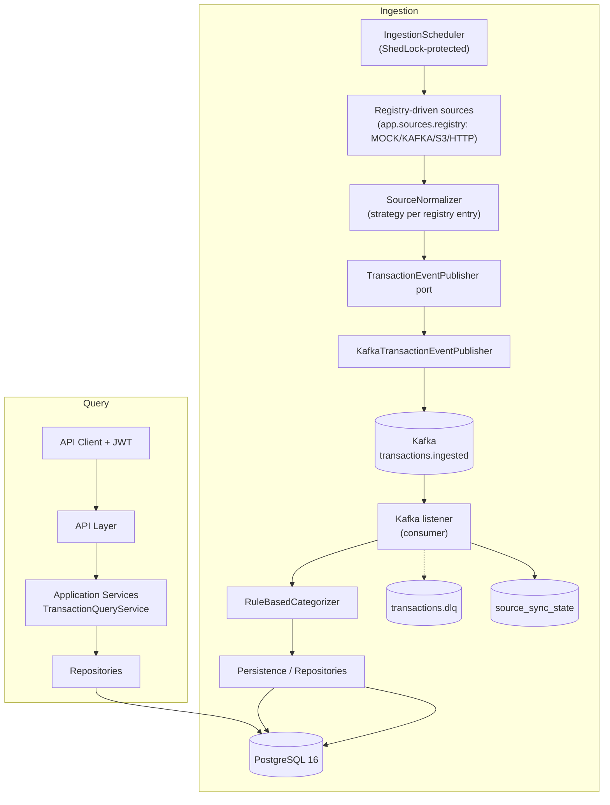

# Artifact 03: Architecture - Transact API

This document describes the high-level architectural design of the Transact platform. The system is designed as a **Modular Monolith** (see ADR 001), ensuring a clean separation of concerns while avoiding the operational complexity of microservices prematurely.

## 1. High-Level Component Diagram

## 2. Layered Architecture (DDD-Inspired)

### 2.1 API Layer (`za.co.evilcorp.transact.api`)
- **Responsibility**: Handle HTTP requests, DTO validation, and RFC 7807 `ProblemDetail` response formatting.
- **Constraint**: No business logic. Only delegates to the Application layer.
- **DTOs**: Response/request records live in `api.dto` (`TransactionDto`, `SummaryDto`, `FreshnessDto`, …) and are never entities.

### 2.2 Application Layer (`za.co.evilcorp.transact.application`)
- **Responsibility**: Orchestrate use cases (e.g., "Get Customer Transactions", "Run Ingestion Cycle").
- **Contents**: stateless services (`TransactionQueryService`, `IngestionService`), the `IngestionScheduler`, and application-level DTOs in `application.dto` for use-case command/result contracts shared between layers.
- **Constraint**: Stateless. Constructor injection only. Coordinates between Domain and Infrastructure; explicit transactions only.

### 2.3 Domain Layer (`za.co.evilcorp.transact.domain`)
- **Responsibility**: Core business logic, entity invariants, and the Canonical Transaction Model (`CanonicalTransaction`, `Category`, `TransactionDirection`).
- **Contents**: the `TransactionCategorizer` port and its `RuleBasedCategorizer` implementation.
- **Constraint**: Pure Java. No dependencies on frameworks (except standard annotations).

### 2.4 Infrastructure Layer (`za.co.evilcorp.transact.infrastructure`)
- **Responsibility**: Technical implementations:
    - **Persistence**: Spring Data JPA / PostgreSQL (`persistence.entity`, `persistence.repository`).
    - **Messaging**: Kafka implementation of the messaging port (`KafkaTransactionEventPublisher`).
    - **Integration**: Registry-driven source transports (`integration.adapter` — `MockTransactionSource`, `KafkaTransactionSource`, `S3TransactionSource`, `HttpTransactionSource`), selected per entry in `app.sources.registry` (ADR 011). Normalization happens at the source boundary via a `SourceNormalizer` strategy (`integration.normalizer`), keyed by the registry entry's `normalizer` field — independent of transport, so an S3 drop and a MOCK file of the same payload shape share a normalizer. The committed default registry ships three `MOCK` sources so the demo/E2E stay deterministic; `KAFKA`, `S3`, and `HTTP` are real transports, opt-in per environment.
    - **Logging**: `CorrelationIdFilter` (MDC `correlationId` from `X-Correlation-ID`).
    - **Observability**: Micrometer metrics and the custom sync `HealthIndicator`.

### 2.5 Security Layer (`za.co.evilcorp.transact.security`)
- JWT authentication filter, token provider, and `CustomerAccessValidator` (path `customerId` must match JWT `sub` unless `ADMIN`).
- **Tenancy note**: tenancy is represented by `customers.tenant_id` (see `docs/02-domain-model.md`) but is not an independent authorization boundary today — isolation is enforced entirely by the `customerId` check above. An earlier `TenantContext` (a request-scoped holder for the JWT's `tenantId` claim) was removed 2026-09-25: it was write-only — populated by the JWT filter, read by nothing — which is a worse state than not having it, since it looks like an enforced control to anyone skimming the code. If cross-customer tenant-level scoping is needed later (e.g., one tenant operator managing several customers), it should be built as a real, tested authorization check, not resurrected as an unused holder. (See `docs/principal_engineer_review_report.md`, finding M-03.)

---

## 3. The Ingestion Pipeline

The system uses a pull-based, scheduled ingestion model that publishes through Kafka.

### 3.1 Messaging Port
To avoid broker lock-in, the application defines its own port: **`TransactionEventPublisher`**. The current implementation is **`KafkaTransactionEventPublisher`**, producing `TransactionIngestedEvent` records to the topic **`transactions.ingested`**. A future `RabbitTransactionEventPublisher` (or SQS/Pub-Sub equivalent) can replace it without touching domain or application code. Poisoned or repeatedly failing events are routed to **`transactions.dlq`**. (See ADR 009.)

Delivery is **at-least-once**; the consumer is idempotent via `UNIQUE(source_id, source_transaction_id)` (ADR 005). The transactional outbox pattern is **deferred** (documented evolution, not implemented).

### 3.2 Scheduler
`IngestionScheduler` runs on a fixed interval (`app.ingestion.interval-ms`). Scheduling is guarded by **ShedLock** so that in a multi-instance deployment only one instance executes a given cycle — preventing duplicate concurrent fetch/publish work without requiring singleton deployments.

### 3.3 Pipeline Flow
1. **Fetch**: The scheduler triggers each registered `TransactionSource` (transport selected by `app.sources.registry`) with the stored cursor from `source_sync_state`.
2. **Normalize**: The source's `SourceNormalizer` strategy converts the raw payload to `CanonicalTransaction`; `normalizationVersion` is recorded.
3. **Publish**: The source publishes `TransactionIngestedEvent` via `TransactionEventPublisher` (bounded retries/backoff on the publish path).
4. **Consume + Categorize**: The Kafka listener applies the `TransactionCategorizer` (`category_code`, `category_version`, persisted `ruleId`).
5. **Persist**: The consumer inserts idempotently — duplicates are rejected by the `UNIQUE(source_id, source_transaction_id)` constraint (insert-or-ignore semantics; no check-then-insert races).
6. **Sync state**: `source_sync_state` is updated to `SUCCESS` (cursor + `last_successful_sync`) or `FAILED` (`failure_count`, `last_error`).

---

## 4. Consistency and Freshness

### 4.1 Eventual Consistency
The system accepts that the API may return data that is slightly behind the actual source state (ADR 002).

### 4.2 Freshness Tracking
The `source_sync_state` table stores per source:
- `last_successful_sync`
- `cursor` (incremental ingestion)
- `status` (`SUCCESS` / `FAILED`)

The API calculates freshness as `now() - last_successful_sync` against configurable thresholds (defaults: 5 min → `FRESH`, 30 min → `STALE`, beyond → `VERY_STALE`).

**Completeness** (`COMPLETE` / `PARTIAL`) is derived from `source_sync_state`: if any configured source's last cycle is not `SUCCESS`, responses carry `completeness: PARTIAL` with per-source detail — partial results are never presented as complete (ADR 008).

## 5. Multi-Tenancy & Security

- **Isolation**: Every query is scoped by `customer_id` carried on transaction rows.
- **Validation**: `CustomerAccessValidator` checks that the authenticated JWT `sub` matches the path `customerId` before the query executes; the `ADMIN` role may access any customer. Authorization is never trusted from the frontend alone.
- **Secret Management**: The JWT secret (`app.security.jwt-secret`) and datasource/Kafka credentials are injected via environment variables — no secrets in code or config committed to the repository.

## 6. Deliberate Non-Goals (current revision)

- No Resilience4j circuit breakers / bulkheads around source fetch or broker publish (per-transport timeouts + `IngestionService`-level bounded retry/backoff only; circuit breakers and bulkheads are evolution). This applies to all four transports, including the real `KAFKA`/`S3`/`HTTP` ones (ADR 011) — a source that is down gets retried and marked `FAILED`, not isolated.
- No transactional outbox (at-least-once + idempotent consumer instead).
- No Redis caching (query-time reads from PostgreSQL; ADR 010).
- No springdoc annotations — `openapi.yaml` at the repo root is the committed contract.

---
**Status**: Implemented
**Owner**: Architect
**Date**: 2026-09-23
